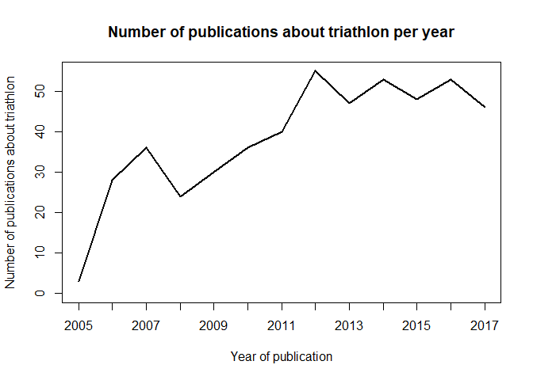
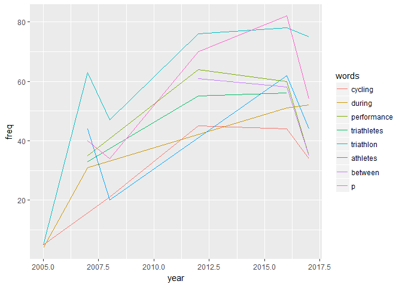
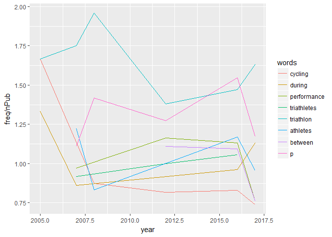
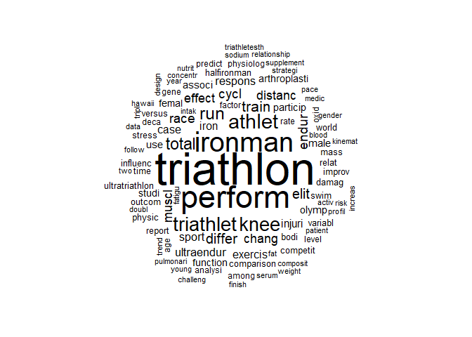
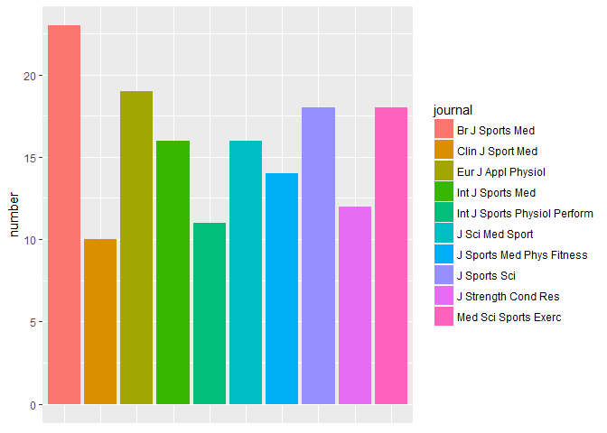

Today I am using the RISmed package which I love, to look through the
Pubmed database for what they have on triathlon. Pubmed is a NIH (USA)
funded database which hosts articles about medicine and biology, so I am
looking at studies that have been done on injuries and disease and human
physiology that have to do with triathlon. I am not a triathlete yet, I
am just focusing on running and I cycle to commute to the lab and swim
as cross training every once in a while and I am planning on starting
with a duathlon this summer and maybe casual triathlons next year
because I want to focus on running this year. I use the Pubmed database
every day for work, and I am very curious to know what has been done for
triathletes specifically, so let's jump right into it!

Number of publications containing the word "triathlon" from 2000-2017
=====================================================================

There are 596 publications on the pubmed database total between the
years 2000 and 2017 about triathlon. Let's see if the number of
publications was stable over the years, with some stats first and a plot
of the number of publications according to the year:

We can see that 13 years ago there weren't many publications about
triathlon but their number increased tenfold after that despite a
decrease in 2008 that might have been due to the financial crisis. In
2012 the number reached a pic and has been pretty stable since at around
50 publications a year. The number of triathletes around the world has
been increasing over the years and it is good that the interest in the
sport has carried on to research publications.

What are the studies about in triathlon?
========================================

Most used words in the abstracts
--------------------------------

We are now going to look at the 10 most used words in abstracts over the
years in the table below in different years:

<table>
<thead>
<tr class="header">
<th align="right">year</th>
<th align="left">words</th>
<th align="right">freq</th>
<th align="right">nPub</th>
<th align="right">year</th>
<th align="left">words</th>
<th align="right">freq</th>
<th align="right">nPub</th>
</tr>
</thead>
<tbody>
<tr class="odd">
<td align="right">2005</td>
<td align="left">s</td>
<td align="right">12</td>
<td align="right">3</td>
<td align="right">2017</td>
<td align="left">triathlon</td>
<td align="right">75</td>
<td align="right">46</td>
</tr>
<tr class="even">
<td align="right">2005</td>
<td align="left">cycling</td>
<td align="right">5</td>
<td align="right">3</td>
<td align="right">2017</td>
<td align="left">p</td>
<td align="right">54</td>
<td align="right">46</td>
</tr>
<tr class="odd">
<td align="right">2005</td>
<td align="left">subsequent</td>
<td align="right">5</td>
<td align="right">3</td>
<td align="right">2017</td>
<td align="left">during</td>
<td align="right">52</td>
<td align="right">46</td>
</tr>
<tr class="even">
<td align="right">2005</td>
<td align="left">swimming</td>
<td align="right">5</td>
<td align="right">3</td>
<td align="right">2017</td>
<td align="left">age</td>
<td align="right">51</td>
<td align="right">46</td>
</tr>
<tr class="odd">
<td align="right">2005</td>
<td align="left">triathlon</td>
<td align="right">5</td>
<td align="right">3</td>
<td align="right">2017</td>
<td align="left">years</td>
<td align="right">51</td>
<td align="right">46</td>
</tr>
<tr class="even">
<td align="right">2005</td>
<td align="left">artery</td>
<td align="right">4</td>
<td align="right">3</td>
<td align="right">2017</td>
<td align="left">athletes</td>
<td align="right">44</td>
<td align="right">46</td>
</tr>
<tr class="odd">
<td align="right">2005</td>
<td align="left">dissection</td>
<td align="right">4</td>
<td align="right">3</td>
<td align="right">2017</td>
<td align="left">study</td>
<td align="right">36</td>
<td align="right">46</td>
</tr>
<tr class="even">
<td align="right">2005</td>
<td align="left">during</td>
<td align="right">4</td>
<td align="right">3</td>
<td align="right">2017</td>
<td align="left">between</td>
<td align="right">35</td>
<td align="right">46</td>
</tr>
<tr class="odd">
<td align="right">2005</td>
<td align="left">plt</td>
<td align="right">4</td>
<td align="right">3</td>
<td align="right">2017</td>
<td align="left">performance</td>
<td align="right">35</td>
<td align="right">46</td>
</tr>
<tr class="even">
<td align="right">2005</td>
<td align="left">swim</td>
<td align="right">4</td>
<td align="right">3</td>
<td align="right">2017</td>
<td align="left">cycling</td>
<td align="right">34</td>
<td align="right">46</td>
</tr>
</tbody>
</table>

The same words don't always come up every year. Some words don't give us
much information like "triathlon" and "subsequent".The words that
interest me are related to biology and medicine, there is "artery" so
there is an interest in vascular system of endurance athletes, "p" for
p-value in statistics, "mass" so there were studies that probably look
at mass body index or muscle/fat mass, and there is also "age", so there
must be studies that compare age of triathletes. The phase of a
triathlon race that comes up most is cycling interestingly, so it might
be what some scientists consider easier to study or a more important
part in the race. A lot of the words do come up in the top ten a few
times, and I am curious to see the evolution of the use of some words,
so let's pull it up right now:

I've drawn two plots here, one where there is simply the frequency of
the use of the top 5 words in abstracts about triathlon of each year,
and the other one is the frequency normalized to the number of
publications. The two plots look drastically different.

-   The first plot shows mostly increase in the words generally, with a
    decrease in 2008 because of the decrease in publications, and then
    another decrease in 2016, probably meaning the top words have just
    shifted to new uses.

-   The second plot shows that there are some words that are present
    either in more than 1 publication or mentioned several times in the
    abstract, their normalized frequency is higher than 1 like "p" for
    p-value (statistics), "performance". The word "cycling" saw a huge
    drop in use over the years. "Triathletes" was rising slowly. Towards
    more recent years, we notice the same thing as in the first plot:
    the top words seem to not be used as much, probably in favor of new
    words and the word "triathlon" is being used more times per
    abstract.

Most used words in the titles
-----------------------------

The title gives a different perspective on the subject because it will
be straight to the point of the article and will have less words that
are not telling us really what the study is about.

<table>
<thead>
<tr class="header">
<th></th>
<th align="left">stsp</th>
<th align="right">Freq</th>
</tr>
</thead>
<tbody>
<tr class="odd">
<td>1711</td>
<td align="left">triathlon</td>
<td align="right">133</td>
</tr>
<tr class="even">
<td>1104</td>
<td align="left">performance</td>
<td align="right">78</td>
</tr>
<tr class="odd">
<td>794</td>
<td align="left">ironman</td>
<td align="right">77</td>
</tr>
<tr class="even">
<td>467</td>
<td align="left">during</td>
<td align="right">69</td>
</tr>
<tr class="odd">
<td>819</td>
<td align="left">knee</td>
<td align="right">43</td>
</tr>
<tr class="even">
<td>36</td>
<td align="left">after</td>
<td align="right">38</td>
</tr>
<tr class="odd">
<td>1672</td>
<td align="left">triathletes</td>
<td align="right">38</td>
</tr>
<tr class="even">
<td>1633</td>
<td align="left">total</td>
<td align="right">36</td>
</tr>
<tr class="odd">
<td>123</td>
<td align="left">athletes</td>
<td align="right">32</td>
</tr>
<tr class="even">
<td>496</td>
<td align="left">elite</td>
<td align="right">29</td>
</tr>
<tr class="odd">
<td>1390</td>
<td align="left">running</td>
<td align="right">29</td>
</tr>
<tr class="even">
<td>1637</td>
<td align="left">training</td>
<td align="right">27</td>
</tr>
<tr class="odd">
<td>501</td>
<td align="left">endurance</td>
<td align="right">26</td>
</tr>
<tr class="even">
<td>977</td>
<td align="left">muscle</td>
<td align="right">23</td>
</tr>
<tr class="odd">
<td>440</td>
<td align="left">distance</td>
<td align="right">22</td>
</tr>
<tr class="even">
<td>179</td>
<td align="left">between</td>
<td align="right">21</td>
</tr>
<tr class="odd">
<td>1785</td>
<td align="left">ultraendurance</td>
<td align="right">21</td>
</tr>
<tr class="even">
<td>792</td>
<td align="left">iron</td>
<td align="right">20</td>
</tr>
<tr class="odd">
<td>1271</td>
<td align="left">race</td>
<td align="right">20</td>
</tr>
<tr class="even">
<td>233</td>
<td align="left">case</td>
<td align="right">19</td>
</tr>
</tbody>
</table>

Now this is interesting: the only body part in the top 20 words used in
titles of articles mentionning triathlon is the knee. I am going to make
the assumption that knee injuries have been studied most in triathlon
based on this result. We also see ironman in there, but not sprint,
olympic or half-ironman so this distance has probably been studied the
most as well. Another interesting word is "iron", and I might be wrong
but I hope it's because they looked at iron carrying molecules in
triathletes. We also see endurance and ultraendurance words there. The
word elite also comes up a lot, which makes sense if most studies look
at results from elite athletes rather than casual triathletes and age
groupers. There is also "muscle" in the top 20 which I find interesting
as well because it is not the biggest part of the training.

WordCloud
---------

So from this we get more words that pop up like sodium supplement,
stress, arthroplasty, hawaii, oxid, which is starting to sound much more
interesting! Now I wanted to look at the words most used in articles
that talk about knees and triathlon so see what about the knees of
triathletes interests researchers:

<table>
<thead>
<tr class="header">
<th></th>
<th align="left">stsp</th>
<th align="right">Freq</th>
</tr>
</thead>
<tbody>
<tr class="odd">
<td>259</td>
<td align="left">triathlon</td>
<td align="right">13</td>
</tr>
<tr class="even">
<td>187</td>
<td align="left">performance</td>
<td align="right">9</td>
</tr>
<tr class="odd">
<td>88</td>
<td align="left">during</td>
<td align="right">7</td>
</tr>
<tr class="even">
<td>217</td>
<td align="left">running</td>
<td align="right">6</td>
</tr>
<tr class="odd">
<td>135</td>
<td align="left">ironman</td>
<td align="right">5</td>
</tr>
<tr class="even">
<td>5</td>
<td align="left">after</td>
<td align="right">4</td>
</tr>
<tr class="odd">
<td>93</td>
<td align="left">endurance</td>
<td align="right">4</td>
</tr>
<tr class="even">
<td>138</td>
<td align="left">knee</td>
<td align="right">4</td>
</tr>
<tr class="odd">
<td>256</td>
<td align="left">triathletes</td>
<td align="right">4</td>
</tr>
<tr class="even">
<td>270</td>
<td align="left">ultraendurance</td>
<td align="right">4</td>
</tr>
<tr class="odd">
<td>6</td>
<td align="left">among</td>
<td align="right">3</td>
</tr>
<tr class="even">
<td>15</td>
<td align="left">associated</td>
<td align="right">3</td>
</tr>
<tr class="odd">
<td>43</td>
<td align="left">changes</td>
<td align="right">3</td>
</tr>
<tr class="even">
<td>49</td>
<td align="left">comparison</td>
<td align="right">3</td>
</tr>
<tr class="odd">
<td>118</td>
<td align="left">heat</td>
<td align="right">3</td>
</tr>
<tr class="even">
<td>204</td>
<td align="left">race</td>
<td align="right">3</td>
</tr>
<tr class="odd">
<td>252</td>
<td align="left">total</td>
<td align="right">3</td>
</tr>
<tr class="even">
<td>16</td>
<td align="left">athlete</td>
<td align="right">2</td>
</tr>
<tr class="odd">
<td>19</td>
<td align="left">balance</td>
<td align="right">2</td>
</tr>
<tr class="even">
<td>24</td>
<td align="left">between</td>
<td align="right">2</td>
</tr>
<tr class="odd">
<td>77</td>
<td align="left">differences</td>
<td align="right">2</td>
</tr>
<tr class="even">
<td>78</td>
<td align="left">different</td>
<td align="right">2</td>
</tr>
<tr class="odd">
<td>83</td>
<td align="left">distance</td>
<td align="right">2</td>
</tr>
<tr class="even">
<td>90</td>
<td align="left">effect</td>
<td align="right">2</td>
</tr>
<tr class="odd">
<td>98</td>
<td align="left">exercise</td>
<td align="right">2</td>
</tr>
<tr class="even">
<td>102</td>
<td align="left">fatigue</td>
<td align="right">2</td>
</tr>
<tr class="odd">
<td>113</td>
<td align="left">genes</td>
<td align="right">2</td>
</tr>
<tr class="even">
<td>145</td>
<td align="left">locomotion</td>
<td align="right">2</td>
</tr>
<tr class="odd">
<td>151</td>
<td align="left">medical</td>
<td align="right">2</td>
</tr>
<tr class="even">
<td>164</td>
<td align="left">muscle</td>
<td align="right">2</td>
</tr>
<tr class="odd">
<td>178</td>
<td align="left">olympic</td>
<td align="right">2</td>
</tr>
<tr class="even">
<td>202</td>
<td align="left">protocol</td>
<td align="right">2</td>
</tr>
<tr class="odd">
<td>211</td>
<td align="left">related</td>
<td align="right">2</td>
</tr>
<tr class="even">
<td>222</td>
<td align="left">sex</td>
<td align="right">2</td>
</tr>
<tr class="odd">
<td>225</td>
<td align="left">sodium</td>
<td align="right">2</td>
</tr>
<tr class="even">
<td>241</td>
<td align="left">swimming</td>
<td align="right">2</td>
</tr>
<tr class="odd">
<td>275</td>
<td align="left">using</td>
<td align="right">2</td>
</tr>
<tr class="even">
<td>284</td>
<td align="left">weight</td>
<td align="right">2</td>
</tr>
<tr class="odd">
<td>1</td>
<td align="left">acclimation</td>
<td align="right">1</td>
</tr>
<tr class="even">
<td>2</td>
<td align="left">activation</td>
<td align="right">1</td>
</tr>
</tbody>
</table>

Top journals that publish on triathlon
======================================

The journal that publishes most on triathlon is the British Journal of
Sports Medicine, which isn't too surprising as the UK are probably the
most competitive country in triathlon. The rest of the top ten journals
to publish in triathlon are also all about sports medicine, except one
which is applied physiology. The top ten doesn't contain very high
Impact factor journals, but this is not surprising either because these
journals don't typically go for this type of publication and don't have
a specific section dedicated to sports science.

Top authors diversity and specialty
===================================

<table>
<thead>
<tr class="header">
<th align="left">name</th>
<th align="right">number of publications</th>
</tr>
</thead>
<tbody>
<tr class="odd">
<td align="left">Knechtle B</td>
<td align="right">66</td>
</tr>
<tr class="even">
<td align="left">Rosemann T</td>
<td align="right">48</td>
</tr>
<tr class="odd">
<td align="left">Rüst CA</td>
<td align="right">41</td>
</tr>
<tr class="even">
<td align="left">Lepers R</td>
<td align="right">38</td>
</tr>
<tr class="odd">
<td align="left">Knechtle P</td>
<td align="right">26</td>
</tr>
</tbody>
</table>

We pulled up the top five most publishing authors for the publications
about triathlon and their number of publications on the table above.
There are 1625 different authors with 1382 authors having only one
publication and 243 authors having at least 2. There are a few authors
in the top 5 that have published a lot on triathlon-related studies,
let's take a closer look at the first two by doing a bit of research:

-   Dr. Beat Knechtle is a swiss MD and on [Research
    gate](https://www.researchgate.net/project/Pacing-in-endurance-athletes)
    has 429 Research items, 25273 Reads, 5029 Citations so he is very
    prolific in the domain and he is also a triathlete and ultrarunner
    himself. You can learn more about him by listening to the
    [ultraScience podcast episode
    50](http://www.scienceofultra.com/podcasts/50), which is hosted by
    Dr. Shawn Bearden and is amazing.

-   Dr. Thomas Rosemann is also an MD from Switzerland but his work is
    not entirely focused on endurance sports but he has contributed
    quite a bit to it. His research gate shows 591 Research items, 38211
    Reads, 12816 Citations.

-   Dr. Rüst CA, after a little search on pubmed is found often on the
    same papers as one or both of the scientists above, he works at the
    same institute in Zurich as Dr. Thomas Rosemann and his researchGate
    shows 193 Research items, 10830 Reads and 2068 Citations.

-   Dr. Lepers R is an INSERM researcher and teaches in France at
    University Bourgogne Franche-Comté and has done a lot of work on
    exercize-related fatigue; his researchgate shows 247 Research items,
    29350 Reads and 5181 Citations.

-   Dr. Patrizia Knechtle, I'm guessing related to or married to the
    first author on the list, I couldn't find much info on her, she is
    on a lot of the same papers as him.

All of these top authors publishing on triathlon work in Europe, mostly
Switzerland, so there must be a high interest in endurance sports there.

Conclusion
==========

This little study on how triathlon is being studied by researchers
specifically in the domain of biology and medicine using the Pubmed
database showed that the focus is mostly on knee injuries. The journals
that publish this kind of study are mostly sports medicine and sports
science dedicated journals rather than more general physiology journals.
The most prolific labs and researchers are in Europe, specifically
Switzerland, and most publish closely together.

For those interested in the code I used it is down below. I hope this
was entertaining and informative, see you next time!

Sciathlete

    library(RISmed)
    subject <- "triathlon"
    res <- EUtilsSummary(subject, type="esearch", db="pubmed", datetype='pdat', mindate=2000, maxdate=2017, retmax=500)
    fetch <- EUtilsGet(res)
    y <- YearPubmed(fetch)
    summary(y)
    plot(table(y), type = "l", main="Number of publications about triathlon per year", xlab = "Year of publication", ylab="Number of publications about triathlon")
    library(qdap)
    library(knitr)
    library(ggplot2)
    myFunc<-function(year){
    articles1<-data.frame('Abstract'=AbstractText(fetch), 'Year'=YearPubmed(fetch))
    abstracts1<-articles1[which(articles1$Year==year),]
    abstracts1<-data.frame(abstracts1)
    abstractsOnly<-as.character(abstracts1$Abstract)
    abstractsOnly<-paste(abstractsOnly, sep="", collapse="")
    abstractsOnly<-as.vector(abstractsOnly)
    abstractsOnly<-strip(abstractsOnly)
    stsp<-rm_stopwords(abstractsOnly, stopwords = qdapDictionaries::Top100Words)
    ord <- data.frame(table(stsp))
    ord<-ord[order(ord$Freq, decreasing=TRUE),]
    ord <- head(ord,10)
    ord <- data.frame('year'= rep.int(year, 10), 'words'= ord$stsp, 'freq' = ord$Freq)
    }
    ofive <- myFunc(2005)
    oseven <- myFunc(2007)
    oeight <- myFunc(2008)
    otwelve <- myFunc(2012)
    osixteen<-myFunc(2016)
    oseventeen<-myFunc(2017)
    all<-rbind(ofive, oseven, oeight, otwelve, osixteen, oseventeen)
    tble <- cbind(ofive, oseven, oeight, otwelve, osixteen, oseventeen)
    kable(tble)
    n_occur <- data.frame(table(all$words))
    n_occur2 <- n_occur[n_occur$Freq > 2,]
    set <- all[is.element(all$words, n_occur2$Var1),]
    ggplot(set, aes(x=year, y=freq, colour=words)) + geom_line() 
    titles1<-data.frame('Title'=ArticleTitle(fetch), 'Year'=YearPubmed(fetch))
    abstractsOnly<-as.character(titles1$Title)
    abstractsOnly<-paste(abstractsOnly, sep="", collapse="")
    abstractsOnly<-as.vector(abstractsOnly)
    abstractsOnly<-strip(abstractsOnly)
    stsp<-rm_stopwords(abstractsOnly, stopwords = qdapDictionaries::Top100Words)
    ordtitles<-as.data.frame(table(stsp))
    ordtitles<-ordtitles[order(ordtitles$Freq, decreasing=TRUE),]
    kable(head(ordtitles,20))
    library(tm)
    library(SnowballC)
    library(wordcloud)
    library(qdap)
    abstractWords <- abstractsOnly
    abstractWordsCorpus <- Corpus(VectorSource(abstractWords))
    abstractWordsCorpus <- tm_map(abstractWordsCorpus, PlainTextDocument)
    abstractWordsCorpus <- tm_map(abstractWordsCorpus, removePunctuation)
    abstractWordsCorpus <- tm_map(abstractWordsCorpus, removeWords, stopwords('english'))
    abstractWordsCorpus <- tm_map(abstractWordsCorpus, stemDocument)
    abstractWordsCorpus <- tm_map(abstractWordsCorpus, removeWords, c('the', 'this', stopwords('english')))
    wordcloud(abstractWordsCorpus, max.words = 100, random.order = FALSE)
    articles <- as.data.frame(titles1, stringsAsFactors=FALSE)
    titleWords <- NULL
    for(i in 1:nrow(articles)){
      if(!is.na(titles1$Title[i])){
        if(gregexpr('knee', as.character(titles1$Title[i]), ignore.case = TRUE)[[1]][1]!=-1){
        titleWords <- c(titleWords, titles1$Title[i])
        }
      }
    }
    library(qdap)
    kneeTitles <- data.frame('Titles'=articles$Title[titleWords])
    abstractsOnly <- as.character(kneeTitles$Title)
    abstractsOnly <- paste(abstractsOnly, sep="", collapse="")
    abstractsOnly <- as.vector(abstractsOnly)
    abstractsOnly <- strip(abstractsOnly)
    stsp<-rm_stopwords(abstractsOnly, stopwords = qdapDictionaries::Top100Words)
    ord<-as.data.frame(table(stsp))
    ord<-ord[order(ord$Freq, decreasing=TRUE),]
    kable(head(ord,40))
    journal <- MedlineTA(fetch)
    jnltble <- data.frame(table(journal))
    journal_count <- data.frame('journal' = jnltble$journal, 'number' = jnltble$Freq)
    journal_count_top10 <- journal_count[order(-journal_count[,2]),][1:10,]
    ggplot(journal_count_top10, aes(x=journal, y=number, fill=journal)) + geom_bar(position="dodge",stat="identity")+
      theme(axis.title.x=element_blank(),
            axis.text.x=element_blank(),
            axis.ticks.x=element_blank())
    auths<-Author(fetch) # creates lists of authors
    Last<-sapply(auths, function(x)paste(x$LastName, x$Initials, sep=" "))
    auths2<-as.data.frame(sort(table(unlist(Last)), dec=TRUE))
    names(auths2)<-c("name", "number of publications")
    kable(head(auths2, 5))
